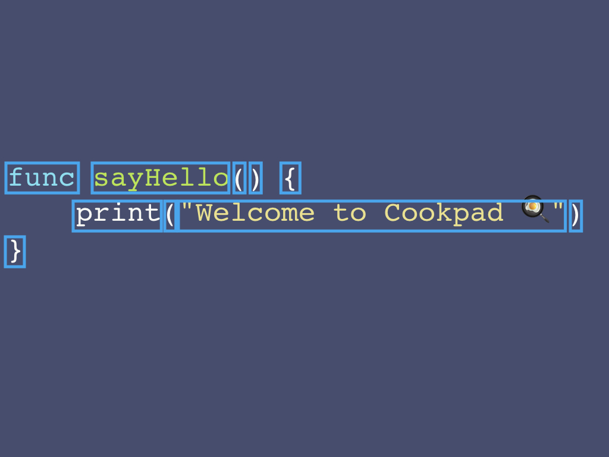
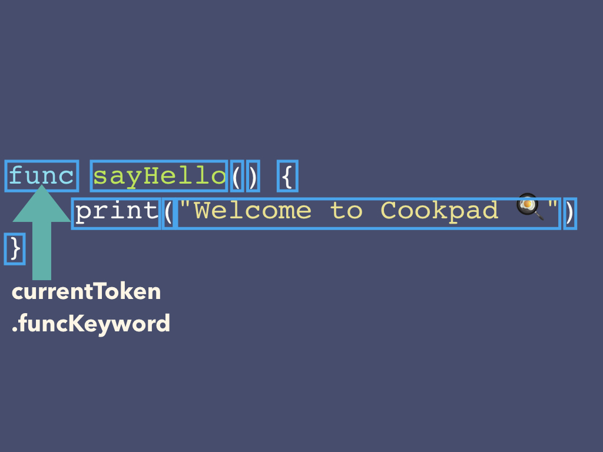
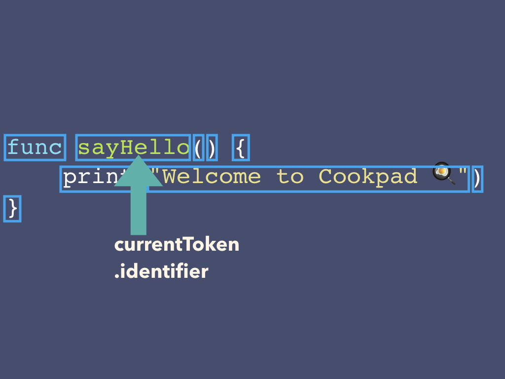
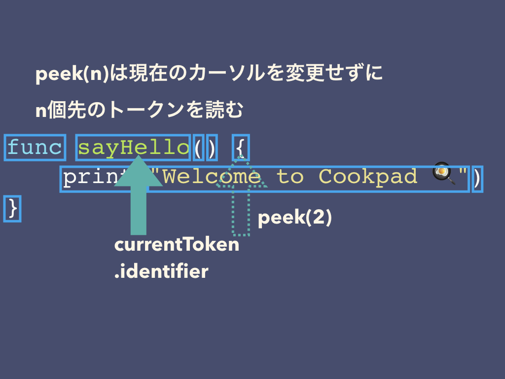

# Practice 1 Parserの基本

SwiftのコードをASTに変換するパーサーを実装していきましょう。

パーサーを1から書くのは非常に大変です。今回はSwiftSyntaxというライブラリを利用します。
https://github.com/apple/swift-syntax

SwiftSyntaxは、Appleが提供するSwiftのソースコードをパースするライブラリです。
静的解析ツールなどにも使われています。

まずは軽い肩慣らしに、パーサーを書くための簡単なユーティリティを準備しましょう。

## SwiftSyntax

## 1-1. `TokenSyntax`の取得

SwiftSyntaxで簡単なSwiftのコードをパースしてみましょう。

```swift
func sayHello() {
    print("Welcome to Cookpad 🍳")
}
```

ソースコードは解析され、キーワードごとにトークンとして分離されます。
トークンはSwiftSyntaxの提供するstruct、`SyntaxToken`で表現されます。



このソースコードの解析結果は以下になります。トークンの種類は`tokenKind`プロパティで取得できます。

`SyntaxToken`は様々なプロパティを持っていますが、このワークショップ内では`tokenKind`だけで事足りるはずです。

|token|TokenKind|
|-----|---------|
|func|funcKeyword|
|sayHello|identifier("sayHello")|
|(|leftParen|
|)|rightParen|
|{|leftBrace|
|print|identifier("print")|
|(|leftParen|
|"Welcome to Cookpad 🍳"|stringLiteral("\"Welcome to Cookpad 🍳\"")|
|)|rightParen|
|}|rightBrace|
|<EOF>|eof|

`Parser`は`SwiftSyntax.SyntaxVisitor`を継承していて、新しいトークンが来る度に`visit`が呼ばれます。
（ビジターパターンについて思い出したいときは、大学の教科書を読み返してみてください)

`Parser`は最初に全てのトークンを読み取り、扱いやすいように`tokens`に配列として保持します。

手始めに最初のテストケースを通してみましょう。

## 1-2. `read()`の実装

多くのパーサーは状態としてカーソルを持っており、トークンを1つずつ頭から読んでいきます。
先頭のトークンを読んで返却するメソッド、`read()`を作りましょう。

このパーサーは、現在のカーソルの示すトークンを`currentToken`として持っています。初期値は`nil`です。

`read()`を呼ぶ度に、カーソルを移動して、移動先のトークンを戻り値として返します。

初期値から`read()`を呼ぶと、最初の`funcKeyword`が返り、カーソルが移動します。



もう1度`read`を呼ぶと、今度は`identifier`を返し、さらにカーソルが移動します。



```swift
// currentToken = nil
read()
// currentToken = funcKeyword
read()
// currentToken = .identifier("sayHello")
read()

// ...
```

## 1-3. `peek()`の実装

`peek()`は現在のカーソル位置を動かさずに、先のトークンを知るためのメソッドです。

`peek()` を呼ぶと、先のトークンを取得できます。カーソル位置は変化しません。



```swift
read()
// currentToken = funcKeyword
peek() // .identifier("sayHello")
peek(1) // .leftParen
peek(2) // .rightParen
```

ウォーミングアップはできましたか？
